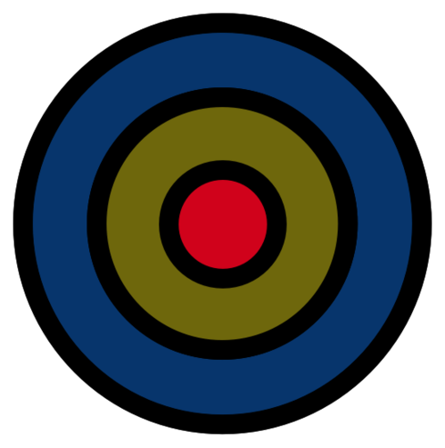
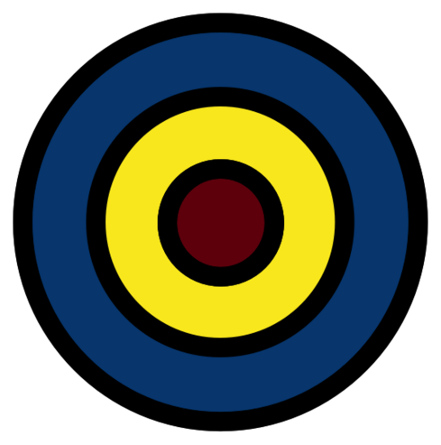

# A Summary of _Traction_
### by Spencer Maroukis

---

## Traction - Marketing For Growth
### Common Themes
1. Startups focus on the same channels
2. It's hard to predict what will work

---

## 3 Growth Phases
* **Phase 1**: <!-- .element: class="fragment highlight-green" data-fragment-index="1" --> 
Making something people want. Test traction channels to see if a product is getting better. <!-- .element: class="fragment highlight-green" data-fragment-index="4"--> 

* **Phase 2**: <!-- .element: class="fragment highlight-blue" data-fragment-index="2"--> Marketing something people want. After finding product-market fit, it is time to really focus on traction and scaling the userbase.
* **Phase 3**: <!-- .element: class="fragment highlight-red" data-fragment-index="3"--> Scaling the business.

---

## The Bullseye Framework

----

One traction channel dominates in terms of customer acquisition. 

----

Identify channels in the **"outer ring"**<!-- .element: class="fragment highlight-blue" -->. Brainstorm a _channel strategy_ for each.
 

Note: Imagine what traction will look like in each channel. Look at what worked in the past in your industry.

----

Select the three most promising channels and build *quick tests*.

----

### Testing

* *How much does it cost to acquire customers through this channel*?
* *How many customers are available in this channel*?
* *Are the customers in this channel the kind we want right now*? 

Note: Tests must answer the following questions. 

----

### Re-evaluating
Re-evaluate your channels, placing them into buckets of "Inner Circle" (inner ring), "Promising" (middle ring), and "Long Shot" (outer ring). 

---

## 19 Traction Channels To Rule Them All
Many are interrelated and feed off one another. You may be comfortable with some, uncomfortable with others. Try them all. You don't know which ones will work.

----

> "Poor distribution, not product, is the number one cause of failure."

----

### Leaky Bucket Analogy
* Time should be ideally split 50/50 on product and traction. 
Note: Think of your startup as a leaky bucket. You use traction early on to see where the holes are in your product (the bucket). You lose a little water but you don't start building something that nobody wants. As you gain traction you begin to plug the holes.

---

# 1. Viral Marketing
> "Optimize Everything"

* Reality: not likely to obtain true exponential viral growth
* But pursuit optimizes "hooks" in the product and its distribution
* Low cost, high volume

----

### Viral Loop
A customer is exposed, loves the product, tells someone else who is exposed, loves the product, tells someone else...
* Provide free branded content
* Minimize friction
* Allow users to test product before signing up

Note: Here is a viral loop. It is pretty simple, but difficult to achieve. The product has to be so good that people want to share it, and it has to be so easy to share that they can. Use branded free content such as Apple with their email sign offs ("Sent from my Iphone"), Youtube with their embedable videos, social sharing links, etc.

----

### Viral Math
* K = [Invites per User] x [Conversion %]
* Conversion %, made of Click Thru % and Sign Up %
* K>1: exponential
* K>0.5: worth pursuing

Note: Optimize Conversion Percentage by optimizing sign up forms. K>1 leads to true exponential growth, but a K value of greater than 0.5 is worth pursuing. 

----

### Testing
* Map out your viral loop
* Find *viral pockets*
* Have personal hooks
* Optimize conversion pages 
    * buttons vs text links / size, color, contrast of CTA / images / copy
* 1% improvement will compound
* Seed with SEO or online ads

Note: Map out your product's viral loop. How can people enter? Cut out unnecessary steps, add more sharability. Do you have any viral pockets? That is are there different subgroups of users of your product that are more prone to go viral? Calculate K for different subgroups. Make things personal and optimize conversion pages. Some example optimizations include testing the use of buttons vs. text links, the size/color/contrast of the call to action (CTA), know that 1% improvement will compound.

----

### Common Mistakes
* Product isn't inherently viral
* Not testing enough
* Virality as a tactic instead of product strategy
* Not learning from others and copying details
Note: Assume only 3/10 changes will lead to an improvement.

---

# 2. Public Relations (PR)
>  "Start Small To Get Noticed"

* Stories now filter *up* the media chain
* Bigger outlets scour smaller ones for captivating stories

----

### Examples
* TechCrunch & Lifehacker pick up stories from Hacker News and Reddit.
* *The New York Times* wraps stories from TechCrunch into a larger narrative.
* Donorschoose.org received local coverage, then *Newsweek*, then *Oprah*, then the *Gates Foundation*

----

### How To Pitch
* Follow industry influencers and reach out to blogs they often link to
* Show significant milestones
    * raising money, launching a product, breaking a usage barrier, a PR stunt, a big partnership
* Combine milestones for a greater impact
* Offer exclusivity and giveaways
* Keep it short and sweet
* [Example Template](email-pitch-templates.mkd)

----

### After Getting a Solid Story
1. Submit it to community sites with large audiences
2. Share it with social networks
3. Email it to influencers that may share with a larger audience
4. Ping bigger blogs 
5. Write a "How We Did This" follow up
Note: After you have a solid story released you need to push it out in the world so it can pick up some steam. Submit it to community sites (remember to be organically engaging weeks and months in advance, show that you add value!), share it with social networks (possibly buy some social advertisements), email it to influencers who may be interested. Once there is some buzz around the article, ping larger blogs for more coverage after the story has traction (remember how the media feeds UP? Be proactive). Use the story and process itself to create more organic content.  

---

# 3. Unconventional PR 
> "Systematize Richard Branson In A Space Suit"

* Publicity Stunts 
* Viral Videos
* Customer Appreciation

----

## Publicity Stunts
* "Halfway, OR" &rArr; "Half.com, OR"
* Richard Branson
* Chargify Bull at SXSW

Note: In 1999 Half.com renamed the town of Halfway, OR for a year when they launched gaining the national spotlight. Chargify hired a matador and a green bull to run around SXSW for $3000 and received hundreds of users from the stunt (the matador was kicked out). 

----

## Viral Videos
* Blendtec's "Will It Blend?" Youtube Videos (8M views)
* Dollar Shave Club's "Our Blades are F\*\*cking Great" (31k fb shares, 9.5k comments)
* Grasshopper.com's "How Entrepreneurs Can Change the World"

----

## Customer Appreciation
* Gifts
* Contests & Giveaways
* Customer Support

Note: Gifts include swag, handwritten notes and books. Contests and giveaways are a great way to get press, if large enough. Great customer support can also lead to great press and reviews, if you consistently come across to your market in a positive and authentic way.  

----

### How To Do It
* Look for larger trends
    * hit themes that don't have a ton of content yet
* Success is unpredictable
    * have a **defined process** for brainstorming and selecting ideas

Note: Look for larger trends to capitalize on media coverage, and try to find ones that don't have a ton of content yet. As is, this channel is especially unpredictable, so have a defined process for brainstorming and selecting ideas.

---

# 4. Search Engine Marketing
> "Find Your Baseline"

* "SEM" or "paid search" or "pay-per-click (PPC)
* Buying ads for keyword searches

----

### Terms
* **CTR**, *click-through rate*: percentage of ad impressions that click
* **CPC**, *cost per click*
* **CPA**, *cost per acquistion*: 
    * CPA = [CPC] / [conversion rate] 
    * *conversion rate*, % that make a purchase after clicking on the ad
* **Quality Score**: overall score that includes CTR, time on site, and more

----

### Case Study: Inflection
> SEM is a way to get early customer data in a fairly controlled, predictable manner...decide to spend $XXX on an advertising campaign to get an early base of customers and users.

* measured CTR on ads for *different* landing pages **before** launching
* spent over $100k/month in SEM on around 50k keywords 
Note: Company behind *archives.com*, sold to *ancestry.com*. SEM provides baseline metrics that are critical for informing your strategy moving forward

----

### Process
1. Find & group high potential keywords into ad groups
2. Test different ad copy/landing pages within an ad group
3. Remove underperformers, tweak existing to improve results

----

### Advice
* Beginning - just test 4 ads
* Track which ads are **converting** (not just being clicked on)
* Successful if close to break even after a few weeks 

----

### Advanced SEM
* Advanced
    * content networks (Google)
    * retargeting (Google, AdRoll, Perfect Audience)
    * conversion optimizer (Google)
    * negative keywords
    * scripting

----

### Resources
* Google
    * AdWords &  Dynamic Keyword Insertion Feature
    * Keyword Planer
* KeywordSpy, SEMrush, SpyFu
* See also: 7. SEO - longtail keywords 

---

# 5. Social & Display Ads
> "Go Broad or Indirect"

* **Display Ads** - are broad
* **Social Ads** - are indirect

----

### Display Ads
* The banner ads you see on websites
* Normally target a broad audience
* In Phase I go directly to smaller sites to advertise <!-- .element: class="fragment highlight-green" -->
* Otherwise use networks like Google's, Advertising.com, Tribalfusion, or niche ad networks

----

### Social Ads
* Ads on Facebook, Twitter, Foursquare, Tumblr, Pinterest, etc. 
* Build awareness, not necessarily to convert
* Create **compelling content** <!-- .element: class="fragment highlight-blue" -->
* Only employ social ad $'s when your message is starting to buzz

Note: Social ads are the ones you see on social networks. They're often not directed at converting users (since it takes away from the social experience), but more towards building a brand image. Create an environment within the social context where you can build a loyal following then migrate this following toward conversion at a later date. Compelling content is key, as a following will only amass around a compelling message. Use content distribution networks such as Outbrain and Sharethrough to get your message out, and once a fire starts to burn around your message deploy social advertisement dollars. 

### Targets
* Make a list of small sites and contact them directly
* Use an indirect response strategy on social ads, providing compelling content first and foremost

---

# 6. Offline Ads
> "[F\*ck It We'll Do It Live](https://www.youtube.com/watch?v=fXZj4Wy58Pk)"

* Radio, TV, magazines, newspapers, billboards, and direct mail

----

### Basics
* What are the demographics? How does this line up with my target customer?
* Request an ad kit
* Use remnant advertising to run cheap tests
* Track with url shorteners, promotional codes, and web hooks

Note: What are the demographics? For example, magazines are still picked up and read by younger audiences, but newspapers are usually reserved for the over 30 age group. Ad kits give you prices and demographics.

----

### Examples 
* InstaCab cyclists handing out business cards
* DuckDuckGo took out a billboard in SoMA (Google's backyard) highlighting Google's privacy issues 
> "An ad might be good for a quarter, or a year, and then decay slowly until it wasn't valuable anymore. It was unpredicatble and decayed over time: so the only thing we were left with was trying everything and measuring what worked" ~ Jason Cohen of Smart Bear

Note: InstaCab hired cyclists to bike around SF and hand out business cards to people waiting for cabs. For direct mail you can buy (legit) mailing lists. For billboards contact Lamar, Clear Channel or CBS Outdoor and use strategic placement. Prices can range from $700-2500/month normally, or $7k/month in SoMa.

----

### Testing
* Remnant advertising
* Ads in small niche publications
* Advertise free products or services

---

# 7. Search Engine Optimization (SEO)
> "Content + Links"

* Ranking high in search results
* Magnifies traction in other channels
* Strategies: Fat Head or Long Tail 

----

> " At its base, SEO is starting with a content strategy and finding a way to attract relevant visitors through search engines. You have to intelligently design this kind of [content] and make sure search engines can find and rank that content.” ~ Rand Fishkin founder of SEO software company Moz

----

## Strategies
Your ability to rank on the first page should be a deciding factor in whether to pursue a particular SEO strategy at all.
* Fat Head vs. Long Tail

----

### Fat Head
* Are search volumes large enough for growth? (10%) 
* New products are harder (no one was searching for "taxi cab alternatives")
* Testing
    * buy Google ads, look at conversion
    * narrow list of keywords, look at trends
    * determine difficulty in ranking high for keywords
    * make sure other sites link to you using desired search terms 

----

### Long Tail
* The majority of searchers
* Bundle long tail keywords together
* Look at competitors websites, check Alexa search rankings
> "Long-tail SEO boils down to producing a lot of quality content."

Note: Long tail searchers make up 70% of online searchers. A popular strategy for startups is to bundle long-tail keywords together to reach a larger audience. Use Google Analytics or Clicky to see what terms people are searching to get to your site. Look at competitors websites to determing if they're getting a lot of traffic, see how many landing pages they have, what terms they're optimizing for, etc. 

----

### Building Links
* Building links is at the heart of SEO
* Use other channels, PR, Content Marketing, and Widgets to drive links
* **Quality content** organically builds links <!-- .element: class="fragment highlight-blue" --> 
    * infographics, slideshows, images and research

---

# 8. Content
> "You Are What You ~~Eat~~ Content"

* Good content &rArr; recognition as an industry leader
* Impacts other channels
* Unbounce and OkCupid Examples

Note: good content leads to recognition as industry leaders and can impact other channels like SEO, publicity, email targeting, blogs, community, offline events, existing platforms, and BD

----

## Unbounce (Phase I)
* Biweekly, shorter posts
* Blogged for a year before launching a product
* Started guest posting after 3 months
* Took over 6 months to get traction
    * First 6 mo.: < 800 monthly visistors 
    * Later: 2k visitors/mo.

Note: Unbounce, a lnding page platform, blogged for over a year before releasing a product. In fact, a blogger was their first hire. They pursued a content strategy of biweekly posts in a shorter form. After three months they started guest posting, or writing blog posts for other blogs. It took them over 6 months to get traffic in this channel, but Unbounce founder Rick Perreault says "Our content still drives customers. Something we wrote in 2010 still drives traffic to us today. Those dollars would've been lost on advertising."

----

## OkCupid (Phase III)
* Switched marketing focus to blogging &rArr; expedient growth 
* Longer posts, less frequent
* Controversial
* Data driven
* Received much more organic PR
 
Note: OkCupid is one of the most popular online dating sites in the US. After several years of trying other traction channels, they started focusing on their blog as a way to get traction in 2009, and things took off (see graphic in book). They wrote controversial posts, and each post took a month to write and drew on the data they had from studying the usage pattersn of their members. 

----

### Lessons
* Create consistently, quality
* After every post ping influencers for feedback
* Engage readers
* Be patient
* Give away free (premium) content to build email list 

----

### How To Produce Good Content
* You should know more about your industry than your potential customers
* Write about problems your potential customers face
* Infographics are 20% more likely to get shared 
* Show readers a problem they don't know they have

----

## Targets
* Blog consistently for 6 months
* Do things that **don't scale** <!-- .element: class="fragment highlight-green" -->
* Create in-depth and unique posts

---

# 9. Email Marketing
> "Test Everything"

* Capitalize on the email lists you've built through other channels
* Advertise on email lists of your prospective customers
* Improve activation rates

Note: What do you consider an "active user"? Here is a chance to convert those who maybe have signed up for your product or service but haven't activated. For dropbox this was uploading at least one file. It could be different for your company.

----

### Types
* The "You Are So Awesome" Email
* The "This Email Will Make You Nostalgic" Email
* The "Access This Premium Feature" Email

----

### Tips
* Successful email marketers A/B test everything
    * subjects, formats, images, timing
* Never send from "noreply@yourdomain.com"
* Trickle update with features

Note: 9a-12p is best for timing. Trickle update means that if a user hasn't opened or downloaded the app/product/service, you should send them a follow up email telling them about some of the features they can use, making it easy for them to dive in. This should improve activation rates.

----

## Targets
* Personalization
* Building a great list
* Set up a series of automatic emails
* Use online tools to A/B test emails

Note: Personalization is key for activating potential users. You'll notice that including a name will increase activation rates - people don't want to feel like they're being spammed. First and foremost you need to build your email list out through other traction channels like SEO and Content. A good way to do this is to provide premium content to your community - but they must sign up for your email list. Have a plan for the series of emails you'll send your email list once they're on it. For example, if you send a wave of new signups a link to your app, make sure to follow up in a few days to either check how its going, or prod users who haven't opened the app - show them some of the great features they're missing, make it easy for them to onboard. Finally, use A/B tools to test emails, as every percentage point matters.

---

# 10. Targeting Blogs
> "Go Where Your Potential Customers Are"

* Good for Phase I
* Advertisements, guest posts, & coverage
* Mint case study

----

## Case Study: Mint
* 20k signups *before* launch, 1M within 6 mo. of launch
* Tested different segments 
* Covered/mentioned by blogs
* Wrote guests posts
* Advertised on smaller blogs
* Used sharability and exlusivity through Mint badges 

Note: Mint tested different segments of possible users by having different types of blogs write about them so they could see who their best audience was. They also advertised on these different blogs and wrote guests posts there as well. In Phase I it is important to test out these different audiences, and blogging is an easy and free way to do so - blogs love having guests post content for them (they get to relax for a day). Bloggers could get priority access if they placed a Mint badge on their site. 

----

## Targets
* Good for **Phase I** <!-- .element: class="fragment highlight-green" --> 
* Make a list of all relevant blogs
* Run tests on a variety of blogs and audiences
* Use linksharing communities to generate traffic, feedback, and buzz

---

# 11. Engineering As Marketing
> "Create Valuable Tools For Prospective Customers"

* Get quality leads
* Solve a problem of your audience
* Keep it as simple as possible
* Look internally for inspiration

----

### Examples
* HubSpot's Marketing Grader
* WP Engine's Wordpress site render speed test

Note: Hubspot is a marketing automation software company with tens of millions in revenue in just a few short years. Their Marketing Grader (marketinggrader.com) site gives you a customized report of how well you're doing with your onine marketing (social media mentions, blog post shares, and basic SEO). The tool was built and used internally first so that the three person team at the time could automate the process of evaluating how good a given company's website was at inbound marketing.

----

### Tactics 
* Take advantage of cyclical behavior
* Create micro-sites for your tool(s)
* Create widgets

----

## Targets
* Standalone, low friction sites that lead back to product or a sales channel
* Extremely relevant to your core business
* Demonstrate value as quickly as possible

---

# 12. Business Development
> "Exchanging Value Through Partnerships"

* Need to be strategic, easy to pursue weak partnerships
* Find mutually beneficial partnerships
* Create a pipeline

----

> "Good BD aligns with company and product strategy. It is always focused on strategic milestones and traction goals"

* Make sure your milestones are defined
* Only pursue partnerships that will help you on this path

----

### Types
* "standard": Apple-Nike
* "joint ventures": new products. Starbucks-Pepsi
* "licensing"
* "distribution deals": Groupon, Kayak powering AOL searches
* "supply partnerships": Hulu and content providers

----

## Targets
* Have a pipeline of 20 potential deals
    * place emphasis on **attributes** instead of name
    * get to know partners' business beforehand
    * seek out advocates and foward thinkers
* Focus on how BD will help you reach the next milestone

Note: Create a pipeline of deals and always be on the lookout for new ones. Make the list by focusing on a business' attributes instead of their brand name. Understand the others' business and have a clear idea of how both sides will benefit. Align BD with your already defined milestones. To find partnerships, find those who are already your advocates within this other company if possible. 

---

# 13. Sales
(more of a B2B strategy, we'll skip this for now)

---

# 14. Affiliate Programs
> "Take A Cut"

* For retail, information products, and lead generation
* Use existing affiliate networks
* Better than PPC since you get to define conversion

----

## Types

----

### Retail
* coupons or deals (like RetailMeNot)
* loyalty programs offer cash back on spending
* aggregators aggregate products from retailers
* email lists - affiliates recommend products to a large audience
* vertical sites like individual blogs

----

### Information Products
* books, software, music, and education
* have their own affiliate networks (Clickbank.com)

----
### Lead Generation
* insurance, law firms and mortgage brokers
* will pay a lot for customers

----

## Targets
* Build a relationship with content creators
* Look to customers as affiliates
* Know how much you are willing to pay for users
* Play a flat fee for conversion
* Keep payouts simple and below cost of acquisition

---

# 15. Existing Platforms
> "Get In The Charts!"

* Appstores and Social Sites

----

## Appstores
* Top apps & featured listings will get traction
* How do you get into the charts?
    * buy ads
    * through other channels
    * high ratings
    * think hard about what the editors are looking for

----

## Social Sites
* Airbnb's crosslisting to craigslist strategy
* YouTube & Myspace

Note: Many of Airbnb's customers were originally posting to craigslist as that was what they were comfortable with. Although Airbnb was a safer alternative, people still wanted the visibility of being on craigslist, so Airbnb build a feature that automatically crossposted Airbnb listings to craigslist. Youtube & Myspace: Myspace didn't have a native video player (no one did at the time), so YouTube made their videos embeddable and leveraged the strength of Myspace at the time. 

## Case Study: Evernote
> "We work day and night, for weeks in advance, to make sure that Evernote is in teh app store on day 1"

* Evernote uses existing platforms as their main traction channel
* They are literally on every device
* The receive early promotion for free, but with risk that platform fails
* They think about what editors want 
    * Evernote Peak used Apple's smart cover to create flashcards

----

## Targets
* Figure out where customers are online
* Create new features to fill a gap of that platform
* Try new platforms

---

# 16. Trade Shows
> "Show It Off"

* Build interest in what you're building or launch it
* Driven by strategic goals
* Look to the future, years in advance 
* Be social
Note: Trade shows are a great way to connect with customers that may be spread out all over the country. They come together at trade shows. It is a great place to build interest in what you're building (pre-launch) or a great place to launch. Again, when you choose what trade shows to visit, if any, make sure it aligns with your strategic goals and milestones. Here it helps to plan in advance, as you may want to visit a trade show a year before you attend as a company. Take advantage of the social atmosphere and host dinners, set up meetings, and meet new people.

----

### Preparation
* Set overarching goals
* Write down all of your industry's events
* Evaluate in the context of your goals
* List key attendees you want to meet, schedule meetings **before** <!-- .element: class="fragment highlight-red" --> the event.
    * editors, bloggers, customers, vendors, potential parteners, press

----

### At the Show
* Have an outbound strategy (talk to people)
* Have a call to action
* Give people a reason to come to you
    * redeemable vouchers, swag, etc.
* Sponsor a dinner with hot ticket speakers
* Partner with others to keep cost down 

---

# 17. Offline Events
> "Scale By Doing Things That Don't Scale" 

* Phase I: meetups and events <!-- .element: class="fragment highlight-green" -->
* Phase II: larger tech conferences like TC Disrupt, Launch Festival, SXSW
* Hosting your own

Note: In phase I when you don't have much traction it is important to do things that don't scale, i.e. attending small meetups and events, talking individually to potential customers, seeing where your message sticks and where it doesn't. This is especially important if your target customers don't have a natural place to congregate online. In Phase II, once you have some early users, try to take advantage of this emerging critical mass by going to a bigger tech/industry conference and really killing it. Alternatively, experiment with hosting your own one day mini-conference to test the waters, just make sure to do some customer outreach first to make sure people will be interested. 

----

## Scaling Offline Events
1. Attend, start your own, or sponsor local meetups
2. Try a day-long mini-conference
3. Consider larger events focusing on attendee quality 

Note: The easiest thing to do is just attend local meetups that are already in your space. I think it is important here not to try to sell anyone on anything - make sure your face is shown a few times, organically engage as part of the community, talk to customers about their problems, and then if these problems align with your solution, show how you can help. Next is starting your own meetup. If you're an SEO firm you would start a meetup that talks about the latest and greatest in SEO software. You can also sponsor a meetup, which could include hosting a meetup in your office space, or providing food and drink to attendees. Throwing a party can also be an effective way to get some traction. Yelp tied this into an exclusivity factor by throwing parties for Yelp Elites (top users) and treating them like VIPs, encouraging other users to be more active on the site. Scaling: you can test if there is an apetite for a larger event by hosting a day-long mini-conference. Make sure to have high quality speakers and attendees. Companies selling products can offset the cost of putting on larger conferences.

----

## Targets
* Attend and engage at local meetups
* See if there is an apetite for bigger events
* Be creative

Note: The only marketing money Twiter ever spent was at SXSW in 2007. They had early users and saw that they could capitalize on the event. They didn't want a booth on the floor, they wanted to be in the hallways, where they thought the action was. They negotiated with the conference and spent $11k to put flatscreen TV's in the hallways with Twitter visualizers, and allowed people to sign up and have their name on the screens by texting to their SMS shortcode.

---

# 18. Speaking Engagements
> "Teaching Sells"

* Benefits other aspects of your business, e.g. management
* Get started for free
* Become a recognized industry expert 
* Get paid to talk and get customers simultaneously 

----

## Getting Started
* Give free talks to small groups of potential customers or partners
* Refine your speeches, build a reputation
* Landing talks
    * establish your expertise
    * pitch conference organizers on what they want to have covered

Note: Start out by giving free talks to small groups of potential customers or partners. Here you can refine your speeches at co-working spaces, nonprofits, and smaller conferences or events. You don't need to market yourself as a speaker, just speak once and do it well and you will get traction. If you do well at smaller events, ask for referrals for larger events.

----

### Speaking Tactics
* *Why are you important enough to be the one giving a talk?*
* *What value can you offer?*
* Have one or two core talks
* Advanced
    * Record speaking engagements
    * Resuse slides - each slide is a story and can be swapped
    * Build relationships at e.g. speakers dinners

----

## Targets
* Speak at a small event, even if you're not pursuing this channel
* Tell a story on stage
* Leverage referrals and past engagements

---

# 19. Build a Community
> "Will You Be ~~Mine~~ My Community?"

* Build an inital audience
* Have a mission
* Be transparent and truly engage

----

### Examples
* Stack Exchange
    * Joel Spolsky and Jeff Atwood were already "internet famous"
    * Found what their community needed and build it
* Reddit
    * Alexis Ohanian sent emails to anyone who wrote about reddit
    * Sent early users shirts, stickers, and other gifts
    * Sponsored open bar tour for redditors

----

### Community Building Tactics
* Have a mission, write a manifesto
* Foster cross-connections, launch with a meta
* Ensure quality through guidelines

Note: It is important to make people feel like they are joining something bigger than themselves. People want to feel empowered by their communities. Have a mission and write a manifesto to define your community's purpose and establish a culture. Foster cross-connections within the community through forums or meetups. Have a Meta, or a place where people can go to discuss the community itself, be open to feedback and be transparent. Establish guidelines early on to ensure quality as the community grows.

----

## Targets
* Build an initial audience
* Cultivate and empower envangelists
* Set standards early on
* Tap your community for product development and potential hires

---

# Fin
* Thanks for listening!
* Get the whole book: 
    * [free with university log in](http://proquest.safaribooksonline.com.proxy.lib.umich.edu/book/sales-and-marketing/9780976339601) | [text](http://tractionbook.com) | [audible](https://www.audible.com/pd/Business/Traction-Audiobook/B01705KJRQ?qid=1500578267&sr=1-2)
* Learn more about **The Edible Project**: <!-- .element: class="fragment highlight-green" --> 
    * [www.edibleproject.io](https://www.edibleproject.io)

